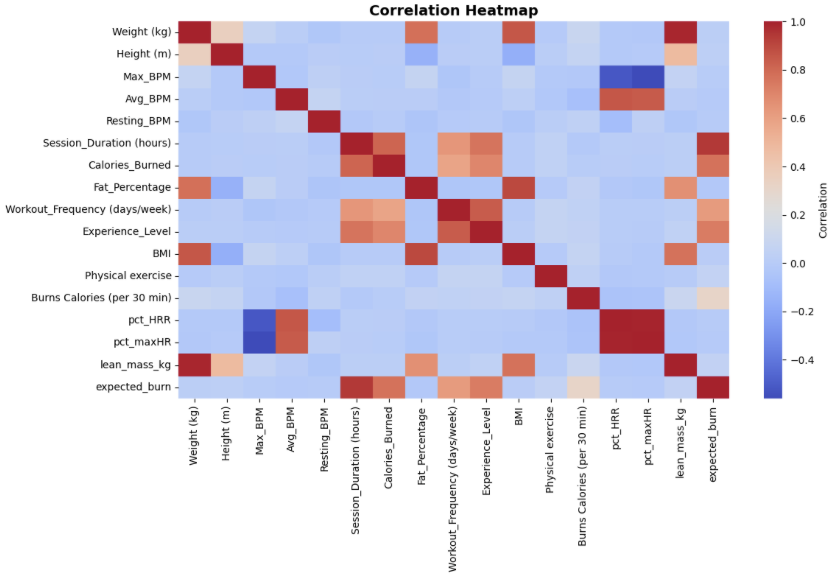
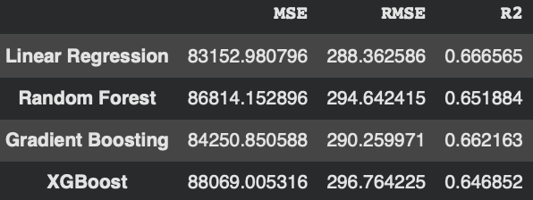
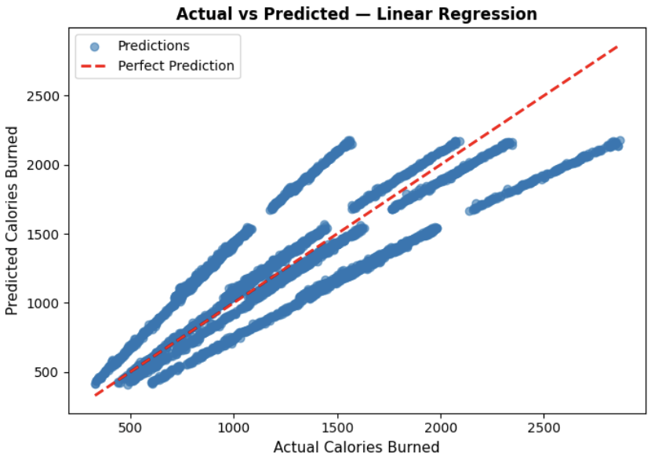
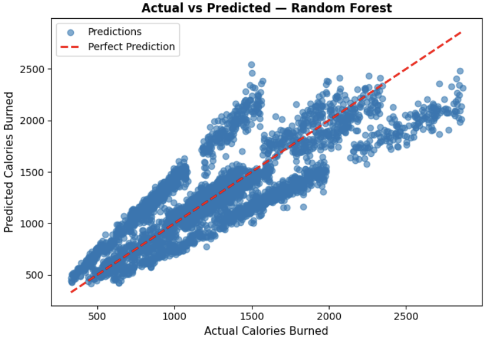
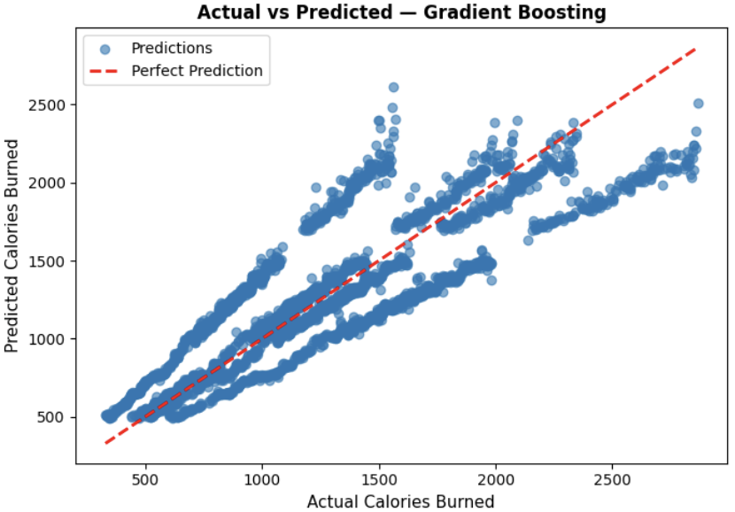
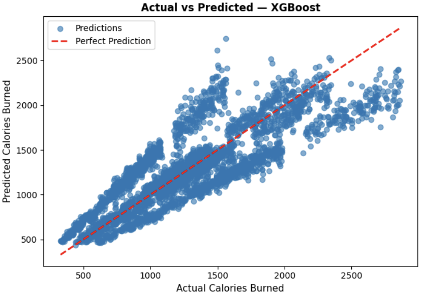
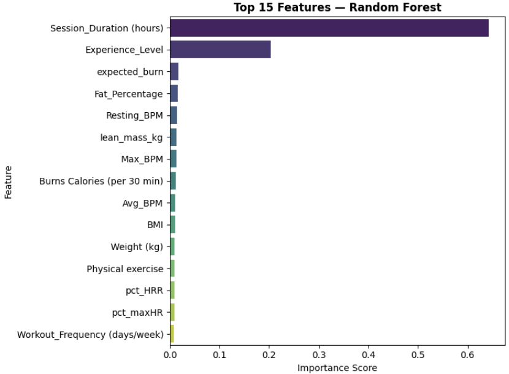
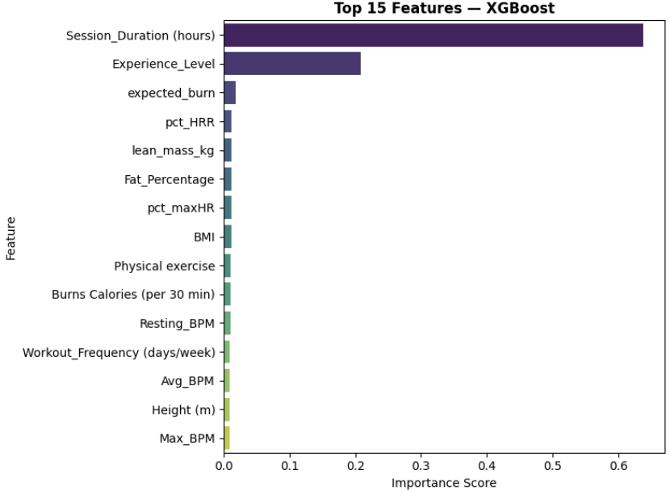
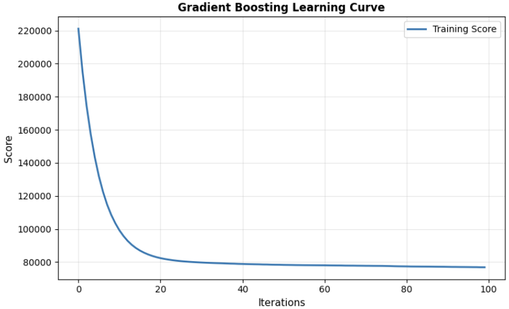

## My Project 
In this project, I applied machine learning techniques in order to determine how the variables linked with lifestyle and workout may be utilized to forecast the number of calories burned throughout the exercise periods. The report outlined below details my method of approach and findings.

***

## Introduction
Proper calculation of the calorie burned in the exercises would be vital in planning exercises, weight loss and individual health evaluation. Simple kinds of estimation like formulas or algorithms in a fitness tracker do not turn out to be very exact when it comes to human physiology. The amount of calories burned will add to several variables, such as the rate of the heartbeat, exercise length, body structure, fitness and kind of exercise taken. Considering the complexities, I sought to come up with a more accurate and data-oriented model that happens to be machine learning-based.

The data that I have worked with consists of approximately 20,000 workout sessions, each being represented in terms of biometric values, heart rate data, type of workout, fitness attributes and total caloric expenditure. The target variable, Calories_Burned is a numerical variable that was counted on each example; hence a supervised regression technique was suitable. I was aiming to assess the efficiency of ecstasis of burning in terms of predicting the number of calories required basing only on a lifestyle and no-fitness-related variables, and to compare the use of which machine learning model. My experiment with a variety of models after running them revealed that Linear Regression and Gradient Boosting gave the most accurate results.

***

## Data
The initial sample was composed of demographic information, nutritional facts, descriptions on exercise, body composition data, and other lifestyle factors. Given that the aim of this project was to predict how many calories are burned during working out and physiologic factors, any type of variables regarding diets (e.g. names of meals, their content of macronutrients, time needed to prepare it, and nutrient content) were not considered. This filtering meant that the analysis would focus on exercise-based predictors, such as heart rate indicators, the type of work-out, how long the workout would last, the percentage of body fat, and the level of fitness experience. The dataset itself was preprocessed, and after it, it consisted of 38 pertinent columns and approximately 20,000 entries.

I started by performing preprocessing tasks that included: 1) finding numeric features, 2) filling-in the gaps with the means of columns, and 3) standardising the data with the StandardScaler that implemented the job of normalising the input distributions. I then divided the data into sets of training and test at 80/20. In the context of my exploratory data analysis, I have created a correlation heatmap, in which it occurred that the strongest predictors of calories burned were maximum and average BPM, and session duration. On the other hand, there was weak or no correlation between demographics like age and height.

{: width="500" }

Figure Caption:
This heatmap indicates correlation of numeric features. There is a strong positive correlation between heart rate indicators and time spent 
working out as well as calories burned, whereas such static characteristics as age do not seem to have any significant impact.

***

## Modelling
As a method to model the calorie expenditure, I applied four supervised regression models, namely, Linear Regression, Random Forest, Gradient Boosting, and XGBoost. Linear Regression was taken as a baseline model to estimate the linear terms of features and calorie output. More elaborated, non-linear interactions were modeled using random forest. Gradient Boosting also enhanced predictions by refining on residual errors thus it is appropriate to data that is moderately non-linear. XGBoost implemented the optimal boosting structure to achieve the additional rapidity and precision.

All the models were trained on the standardized training data, and the test set was predicted. Below is an example of a code that is used to train the Gradient Boosting model.
```python
from sklearn.ensemble import GradientBoostingRegressor

model = GradientBoostingRegressor(random_state=42)
model.fit(X_train_scaled, y_train)
predictions = model.predict(X_test_scaled)

```

***

## Results
I also checked the models on Matthean Squared Error (MSE), root mean squared error (RMSE), and the coefficient of determination (R2). Linear Regression achieved the best output of a R2 of 0.6666 and RMSE of 288.36. Close behind was Gradient Boosting with an R 2 of 0.6622. Conversely, the simpler Linear Regression and more focused Gradient Boosting algorithm did the simplest and more specific operation and thus were more productive in this task than the more complex ensemble procedures such as Random Forest (R2 of 0.6519) and XGBoost (R2 of 0.6469).
{: width="500" }

The scatter plots were made to compare the actual versus model prediction of calorie in the models. Such plots demonstrate the proximity of the approximations with the actual results.
{: width="500" }
{: width="500" }
{: width="500" }
{: width="500" }

The plots of feature importance were created, always showing the predictors of calorie burn as the maximum BPM, average BPM, and session duration. Such findings are consistent with general physiological laws, according to which the intensity and the duration of an exercise are the key determinants of energy utilization.
{: width="500" }
{: width="500" }

The gradient boosting model also sketched a learning curve, which was used to determine how the training performance improved with each iteration and also to ensure possible overfitting.
{: width="500" }

***

## Discussion
Linear Regression and Gradient Boosting have been calculated using models and model results indicate that 2/3 of the calorie burn variance was accounted. The good performance of Linear Regression models indicates that the predominant data trends were linear, whereas Gradient Boosting precision was an indicator of minute non-linear trends. There are however some limitations to this analysis. The model itself has been trained using the two 20,000 available workout sessions and this may not reflect the entire population groups and conditions of exercise. Notably important variables like the continuous changes in heart rate, the environment and omission of dietary factors, may constrain the capacity of the model to encompass all the effects on calories expenditure. Also, outcomes can be affected by the quality of the data and the accuracy of self-reported or variables measured by devices. Irrespective of these drawbacks, as experienced in the analysis, machine learning can be utilized to generate meaningful predictions using available fitness data in the field of exercise science. These results prompt additional research of finer physiological outcomes and higher volume and more varied datasets to increase accuracy and generalizability of a model.

Scatter plots of the actual and the predicted values of Linear Regression and Gradient Boosting revealed that actual calorie values were very close to those of the actual calorial values as observed by the clustering of the values around the diagonal. Random Forest and XGBoost exhibited more scatter and less alignment, which proves that their higher level of complexity did not provide more accurate results than the most successful ones. The importance of heart rates measurements and time spent in the session supported the central role of these variables and confirmed the previously known correlation between intensity, duration, and calories burned on a workout.

***

## Conclusion
Overall, the best predictors of calories burned based on workout and lifestyle data were Linear Regression and Gradient Boosting, which indicated the influence of the heart rate and duration of the workout. Measures of accuracy were ensured by excluding irrelevant variables.

Continuous heart-rate data, deep learning model, and hyperparameter tuning could be used in the future, or the dataset could be expanded to enhance the generalizability.

[Code]([https://www.markdownguide.org/basic-syntax/](https://colab.research.google.com/drive/1kPUHjUCvFjw2fYSHncqKHjmj31m1aJJm?usp=sharing)).
[Dataset]([https://www.markdownguide.org/basic-syntax/](https://www.kaggle.com/datasets/jockeroika/life-style-data/data)).
